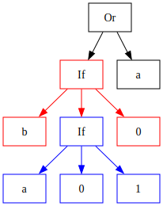
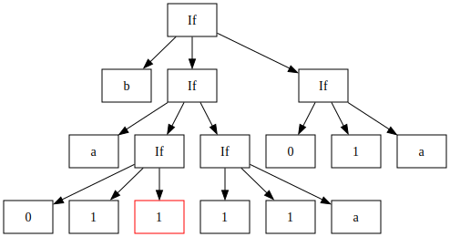
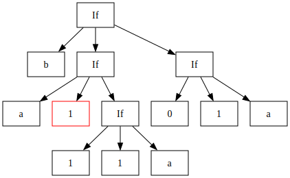
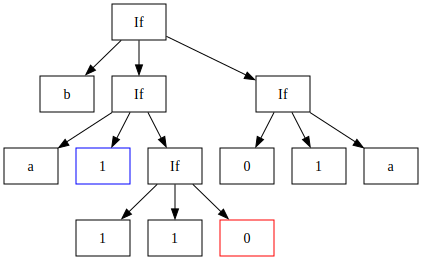
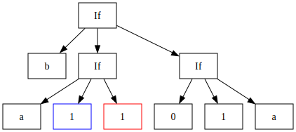
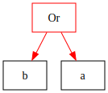

# Boolean Reduction Notes

## AST Definition
```python
v(x)            # An identifier with name x.
imm(c)          # An immediate with value c in {0, 1}.

not(e)          # The logical negation of expression e.
or(e1, e2)      # The logical or of expressions e1 and e2.
and(e1, e2)     # The logical and of expressions e1 and e2.

if(e1, e2, e3)  # If e1 resolves to 1, then e2, otherwise e3. (Ternary)
                # NOTE e1 is known as the "condition", e2 as the "consequence",
                # and e3 as the "alternative".
```
__NOTE__ that all types above are themselves valid expressions.

### Example

__ALSO NOTE__ that for the remainder of this document we will be transforming
the following expression as an example.

```python
or(
    and(
        v(b), 
        not(v(a))
    ), 
    v(a)
)
```
<p align="center">
    
</p>

## `toIf` Definition

This function takes an expression and converts it into a equal if expression.

An __if expression__ is an expression which only contains variables, immediates, and
ternaries.


`toIf` depends on the following semantic equalities.

```python
not(e)      = if(e, imm(0), imm(1))
or(e1, e2)  = if(e1, imm(1), e2)
and(e1, e2) = if(e1, e2, imm(0))
```

`toIf` uses the above rules recursively...

```python
toIf(v(x))      = v(x)
toIf(imm(c))    = imm(c)

toIf(not(e)) = 
    if(toIf(e), 
        imm(0), imm(1))

toIf(or(e1, e2)) = 
    if(toIf(e1), 
        imm(1), toIf(e2))

toIf(and(e1, e2) = 
    if(toIf(e1), 
        toIf(e2), imm(0))

toIf(if(e1, e2, e3)) = 
    if(toIf(e1), 
        toIf(e2), toIf(e3))
```

### Example
```python
# Initial 
or(
    and(
        v(b), 
        not(v(a))
    ), 
    v(a)
)
```
<p align="center">
    
</p>

```python
# toIf Part 1
or(
    and(
        v(b), 
        if(v(a), imm(0), imm(1))
    ), 
    v(a)
)
```

<p align="center">
    
</p>

```python
# toIf Part 2
or(
    if(
        v(b), 
        if(v(a), imm(0), imm(1)),
        imm(0)
    ), 
    v(a)
)
```

<p align="center">
    
</p>

```python
# toIf Part 3 
if(
    if(
        v(b), 
        if(v(a), imm(0), imm(1)),
        imm(0)
    ), 
    imm(1),
    v(a)
)
```

<p align="center">
    
</p>

## `norm` Definition

This function converts an if expression into a normal if expression. 

A __normal if expression__ is an if expression in which all condition expressions
are immediates or variables.

```python
# An example of a normal if expression.
if(imm(0), v(x), v(y))      # A normal if expression.

# An example of a non normal if expression.
# A ternary can never be itself a condition.
if(if(imm(0), v(x), v(y)), imm(1), imm(0))

# Note that standalone variables and immediates are also
# examples of normal if expressions
v(x)
imm(1)
```
The `norm` function abides by the following recursive definition.
```python
# First we define a helper funciton: join.
#
# This function takes an if expression whose 3 subexpressions 
# are normal and returns a semantically equal normal if 
# expression.

join(if(v(x), e2, e3))      = if(v(x), e2, e3)
join(if(imm(c), e2, e3))    = if(imm(c), e2, e3)

join(if(if(v(x), e2, e3), e4, e5) =
    if(v(x), join(if(e2, e4, e5)), join(if(e3, e4, e5))

join(if(if(imm(c), e2, e3), e4, e5) =
    if(imm(c), join(if(e2, e4, e5)), join(if(e3, e4, e5))

# Now for norm.

norm(v(x))   = v(x)
norm(imm(c)) = imm(c)

norm(if(e1, e2, e3)) = join(if(norm(e1), norm(e2), norm(e3)))
```

### Example

```python
# Initial
if(
    if(
        v(b), 
        if(v(a), imm(0), imm(1)),
        imm(0)
    ), 
    imm(1),
    v(a)
)
```
<p align="center">
    
</p>

```python
# Normed
if(
    v(b), 
    if(
        v(a), 
        if(imm(0), imm(1), v(a)), 
        if(imm(1), imm(1), v(a))
    ), 
    if(imm(0), imm(1), v(a))
)
```
<p align="center">
    
</p>

## `eval` Definition
This function converts a normal if expression into a equivalent, potentially reduced 
normal if expression.

```python
eval(v(x))    = v(x)
eval(imm(c))  = imm(c)

eval(if(imm(1), e2, e3)) = eval(e2)
eval(if(imm(0), e2, e3)) = eval(e3)

eval(if(v(x), e2, e3)) = 
    define
        r2 as eval(e2[v(x) <- imm(1)])
        r3 as eval(e3[v(x) <- imm(0)])
    in
        when r2 = r3 then r2
        when r2 = imm(1) and r3 = imm(0) then v(x)
        otherwise if(v(x), r2, r3)
```

### Example

```python
# Initial
if(
    v(b), 
    if(
        v(a), 
        if(imm(0), imm(1), v(a)), 
        if(imm(1), imm(1), v(a))
    ), 
    if(imm(0), imm(1), v(a))
)
```
<p align="center">
    
</p>

```python
# Eval Part 1
if(
    v(b), 
    if(
        v(a), 
        if(imm(0), imm(1), imm(1)), 
        if(imm(1), imm(1), v(a))
    ), 
    if(imm(0), imm(1), v(a))
)
```
<p align="center">
    
</p>

```python
# Eval Part 2
if(
    v(b), 
    if(
        v(a), 
        imm(1),
        if(imm(1), imm(1), v(a))
    ), 
    if(imm(0), imm(1), v(a))
)
```
<p align="center">
    
</p>

```python
# Eval Part 3
if(
    v(b), 
    if(
        v(a), 
        imm(1),
        if(imm(1), imm(1), v(0))
    ), 
    if(imm(0), imm(1), v(a))
)
```
<p align="center">
    
</p>

```python
# Eval Part 4
if(
    v(b), 
    if(
        v(a), 
        imm(1),
        imm(1)
    ), 
    if(imm(0), imm(1), v(a))
)
```
<p align="center">
    
</p>

```python
# Eval Part 5
if(
    v(b), 
    imm(1),
    if(imm(0), imm(1), v(a))
)
```
<p align="center">
    
</p>

```python
# Eval Part 6
if(
    v(b), 
    imm(1),
    v(a)
)
```
<p align="center">
    
</p>

## `reduce` Definition
This function converts an if expression back to a general boolean expression.

__NOTE__ `reduce` is the inverse of `toIf`.

```python
reduce(v(x))    = v(x)
reduce(imm(c))  = imm(c)

reduce(e1, imm(0), imm(1))  = not(reduce(e1))

reduce(e1, imm(1) e2)   = or(reduce(e1), reduce(e2))
reduce(e1, e2, imm(0))  = and(reduce(e1), reduce(e2))      
```

### Example

```python
# Initial 
if(
    v(b), 
    imm(1),
    v(a)
)
```

<p align="center">
    
</p>

```python
# Reduced
or(v(b), v(a))
```

<p align="center">
    
</p>
